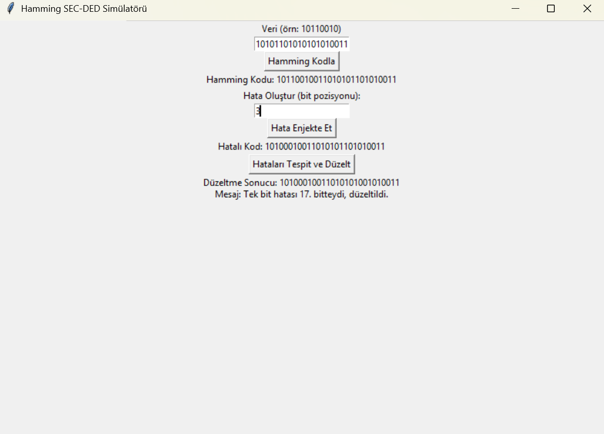

# Hamming SEC-DED Simülatörü

Bu proje, BLM230 **Bilgisayar Mimarisi** dersi kapsamında geliştirilmiştir.  
Projenin amacı, Hamming SEC-DED (Single Error Correcting, Double Error Detecting) algoritmasını kullanarak bit hatalarını tespit edip düzeltmektir.

## 🔍 Proje Özeti

- 8, 16 veya 32 bitlik veri girişi yapılabilir.
- Girilen veriye **Hamming kodu** hesaplanır ve gösterilir.
- Kullanıcı bir bit pozisyonu belirleyerek yapay hata oluşturabilir.
- Hatalı kod üzerinden sendrom değeri hesaplanarak **tek bit hatası düzeltilir**, çift bit hatası ise **tespit edilir**.
- Tüm işlemler kullanıcı dostu bir **Tkinter arayüzü** üzerinden gerçekleştirilir.

## 🎮 Özellikler

✅ Bit verisi girme  
✅ Hamming SEC-DED kodu üretme  
✅ Hatalı bit enjekte etme  
✅ Hata tespiti ve düzeltme  
✅ Görsel kullanıcı arayüzü (GUI)

## 🖥️ Ekran Görüntüsü



## 🚀 Nasıl Çalıştırılır?

1. [Python](https://www.python.org/downloads/) 3.10+ sürümünü kur.
2. Aşağıdaki komutla programı çalıştır:

```bash
python hamming_sim.py
